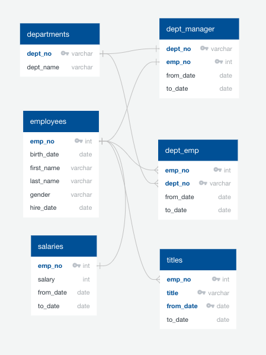

# Pewlett Hackard Analysis

## Overview
The purpose of this project was to determine the number of Pewlett Hackard employees that were close to retirement so that the company can prepare to hire and train new employees. The problem was addressed by creating a Postgres database and querying the database using structured query language (SQL). 

## Resources
Software: pgAdmin 4 v4.14 and PostgreSQL 12.3.

## Methods & Challenge Encountered
Steps taken to solve the problem were as follows:
- An Entity Relationship Diagram (ERD; Figure 1) was made to plan the creation of a new database. 

### Figure 1. Entity Relationship Diagram (ERD) of PH-EmployeeDB

- A Postgres database, "PH-EmployeeDB", was created in pgAdmin 4 by making tables according to the ERD and uploading csv files of company data to the tables. Each table corresponds to a csv file with the same name. See [schema.sql]<(Resources/schema.sql)> for table creation code.
- The database was queried with SQL to determine the number of individuals retiring and the number available for mentorship roles. See [queries.sql]<(Resources/queries.sql)> for query code. Steps are described here:

### Part 1
- To determine the number of individuals retiring:
    - A count (1A) was generated of the rows of the table "employees" where employee birthdates were between 1965-12-31 and 1952-01-01, and where hire dates were between 1988-12-31 and 1985-01-01. 
    - Another count (1B) was generated where birthdates were between 1955-12-31 and 1952-01-01, and hire dates were the same. 
- To determine counts of potential retirees by job title:
    - The table "employees" was filtered for the same criteria as count 1A to create a new table, "retirement_info".
    - Table "retirement_info" was left-joined to table "dept_emp" and filtered by the "to_date" column to include only currently-working employees, creating the new table "current_emp".
    - Table "current_emp" was inner-joined to tables "titles" and "salaries" to include columns "title", "from_date", and "salary", creating the new table "title_emp".
    - Duplicate rows in "title_emp" were discarded, keeping rows corresponding to the most recent job title for each employee. To accomplish this, "title_emp" was partitioned by "emp_no" and ordered by descending "from_date". Then, the first row (containing the most recent job title) for each employee was selected to create the table "recentTitle_emp" (exported as [emp_by_title.csv]<(Queries/emp_by_title.csv)>). 
    - For table "recentTitle_emp", a count of "emp_no" was generated and grouped by "title" to create a new table "countByTitle_emp" (exported as [count_by_title.csv]<(Queries/count_by_title.csv)>).

### Part 2
- To determine the number of individuals being hired:
    - Table "employees" was inner-joined to "salaries" since the "from_date" column (in "salaries") would validate the "hire_date" column (in "employees"). It was also inner-joined to "dept_emp" in order to inner-join to "departments" to include the "dept_name" column. This would show which departments hired each employee. Rows were ordered by descending hire date. Thus, the new table "duplicates_hired" was created. 
    - Duplicate rows where an employee was hired into multiple departments were combined so that the department names and department numbers appeared on the same row. This was accomplished by using "string_agg()" on "dept_name" and "dept_no" columns, and grouping by remaining columns. Thus, the new table "hired" was created (exported as [hired.csv]<(Queries/hired.csv)>). Table "hired", being ordered by descending "hire_date", showed that the most recent hire dates on record were in 2000 (with January being the only month that year on record).
    - A count of "emp_no" in table "hired" where "hire_date" was filtered to January 2000 yielded the result of 13 employees hired that year. 

### Part 3
- To determine the number of individuals available for mentorship roles:
    - Table "recentTitle_emp" was inner-joined to "titles" to include the "to_date" column, and inner-joined to "employees" to filter for birth dates between 1965-01-01 and 1965-12-31, creating a new table "duplicates_mentor_emp".
    - Duplicate rows in "duplicates_mentor_emp" were discarded, keeping rows corresponding to the most recent job title for each employee. To accomplish this, "duplicates_mentor_emp" was partitioned by "emp_no" and ordered by descending "to_date". Then, the first row (containing the most recent job title) for each employee was selected to create the table "mentor_emp" (exported as [mentor_emp.csv]<(Queries/mentor_emp.csv)>). 

A challenge encountered was determining the number of mentorship roles available, given a filter of birthdates between 1965-01-01 and 1965-12-31, and that mentors needed to be from the table of potential retirees created in Part 1. Initially, the birthdate criterion for potential retirees was set to between 1955-12-31 and 1952-01-01 to create the "retirement_info" table. Thus, all tables and queries using "retirement_info" data were filtered by that criterion. The birthdate criterion for eligibility as a mentor was between 1965-01-01 and 1965-12-31, which was not included in the initial birthdate criterion for potential retirees. Thus, a different count (1A) of potential retirees was determined, a new "retirement_info" table was created (filtered by the new birthdate criterion), and all subsequent tables using data from "retirement_info" had to be re-created. The revised birthdate criterion changed the counts for potential retirees by job title in [count_by_title.csv]<(Queries/count_by_title.csv)>. See [queries.sql]<(Resources/queries.sql)>, Part 1A to 1G, to view code pertaining to the encountered challenge.

## Summary & Discussion
Analysis results were as follows:
- Assuming that potential retirees are 54-68 years-old (birthdates between 1965-12-31 and 1952-01-01) and that they have worked 31-35 years for the company (hire dates between 1988-12-31 and 1985-01-01), then the number of individuals retiring is 108,958.
- If the age range is narrowed to 64-68 years-old (birthdates between 1955-12-31 and 1952-01-01), then the number of individuals retiring is 41,380.
- For counts of potential retirees by job title, see [count_by_title.csv]<(Queries/count_by_title.csv)>.
- For a table of potentital retires sorted by job title, see [emp_by_title.csv]<(Queries/emp_by_title.csv)>.
- January 2000 is the most recent month and year included in hiring records. In that year (for which there are only records available in January), 13 employees were hired.
- If mentors are required to be 54-55 years-old (birthdates between 1965-12-31 and 1965-01-01) and have had to work 31-35 years for the company (hire dates between 1988-12-31 and 1985-01-01), then the number of individuals available for mentorship roles is 691.
- For a table of potential mentors sorted by job title, see [mentor_emp.csv]<(Queries/mentor_emp.csv)>. 

The analysis is limited because data for hire dates and salaries are not up-to-date. The number of individuals being hired currently (at the time of this report) cannot be determined from the database because the latest hire dates on record are from January 2000. Also, even though dept_manager.csv, dept_emp.csv, and titles.csv are up-to-date as evidenced by '9999-01-01' entries in the "to_date" column, there is no salary data on record after 2001-01-31. Salary data is only available for the year after an employee's hire date. Thus, employees who have changed departments, who have been promoted to senior positions, or who have gained salary promotions due to increased years of service would have different salaries than what is recorded in salaries.csv.

Recommendations for further analysis include the following:
- Determine if current department managers are potential retirees. If they are, determine which are eligible for mentorship roles.
- Create a table of potential future department managers based on a filter criterion of number of years worked in a department. After an additional selection process, these employees could be paired with retiring managers for mentorship. 
- Determine number of potential retirees grouped by department so that Pewlett Hackard can anticipate the number of employees to hire per department. 
- Create a table of potential retirees who are eligible for mentorship roles, and order the table by department. Pewlett Hackard could use this data, combined with the number of potential retirees per department, to decide which departments to choose to trial a mentorship program. Ideally, departments would have a high percentage of new hires (or employees who are not potential retirees) and a higher number of potential mentors. Since there are only 691 potential mentors, this table could include employee info such as employee number, birthdate, first name, last name, gender, job title, and department name.
- It is recommended that employees.csv is updated to include employees hired after January 2000. A table could be created of newly-hired or more-recently-hired employees ordered by department, and these employees could be paired with mentors. 